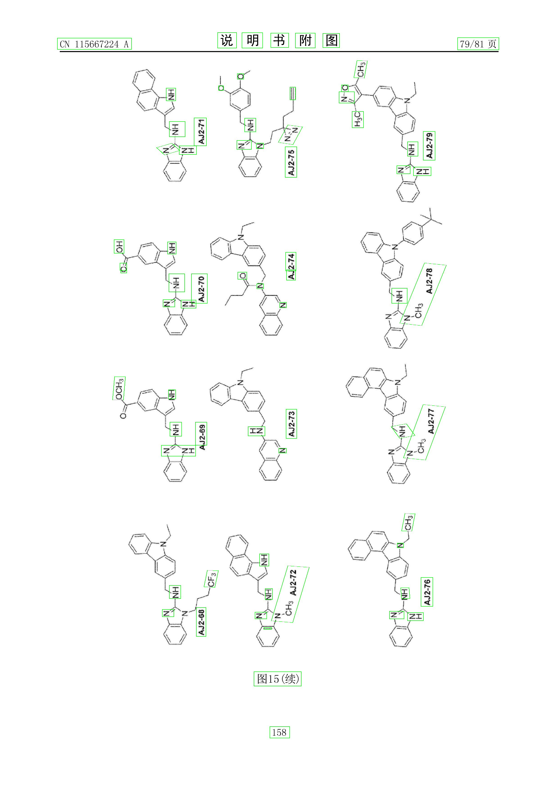
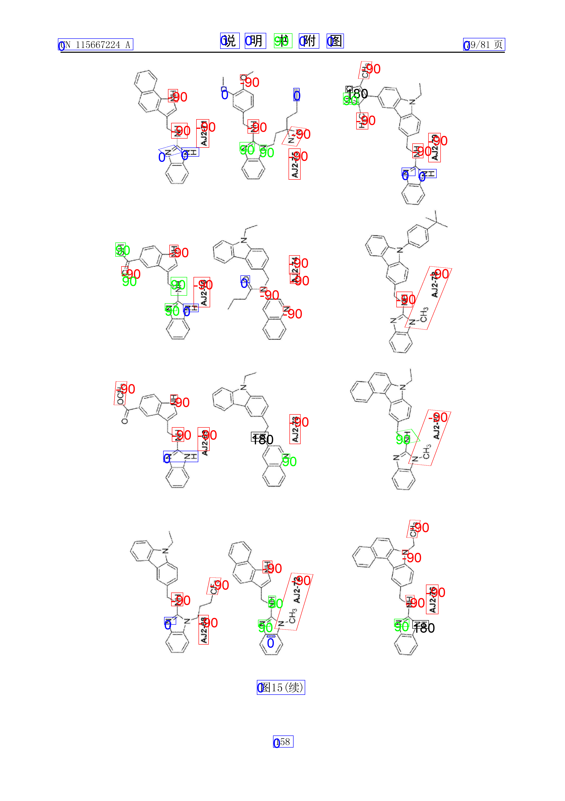
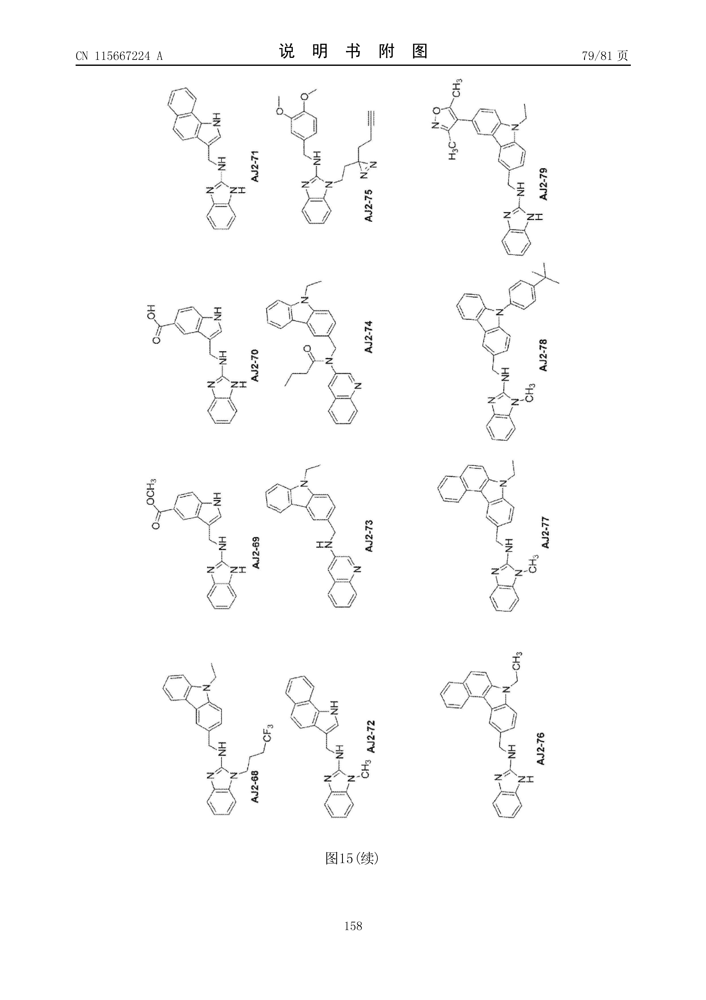
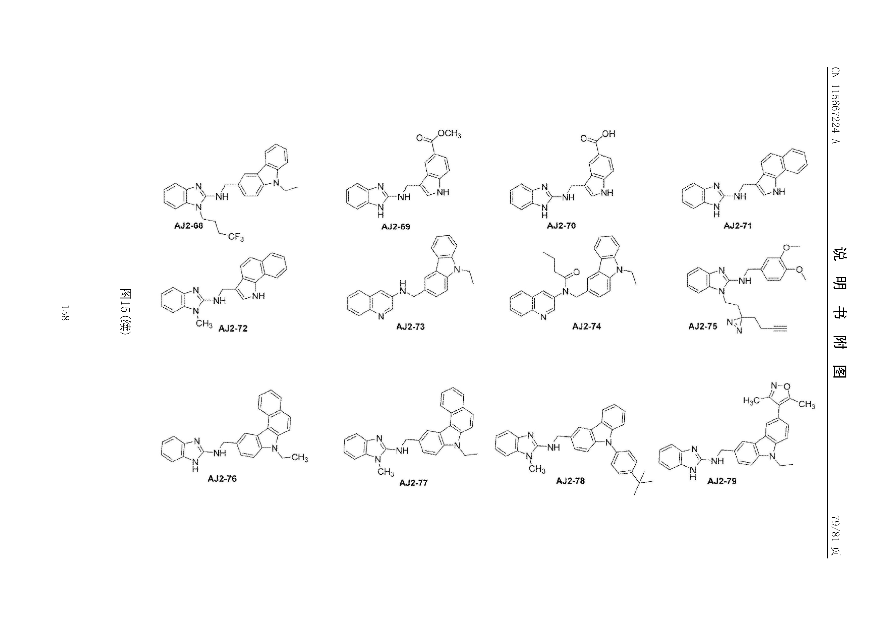

## 1. 介绍
本仓库提供了一套高效的文档图像预处理工具，专注于解决 ​​文档页面角度矫正问题​​，尤其针对以下两种常见场景：
​
* `0°`文档​​：标准水平放置的文档（无需矫正）。
* ​`-90°`文档​​：垂直旋转90度（逆时针旋转）的文档（重点优化场景）。
通过智能检测和几何变换，自动将倾斜或旋转的文档校正为标准阅读方向，显著提升后续OCR或内容分析的准确性。

> 当前版本​​无法较好地区分`0°`和`180°`​​、​`​-90°`和`90°​​`

## 2. 为什么选择本工具？​​
✅ ​​高频场景覆盖​​：
解决80%以上的文档旋转问题（0°/90°/-90°为主，180°较少见）。
对OCR、文档分类等下游任务足够鲁棒。


✅ ​​极速响应​​：
基于传统图像处理算法（无深度学习依赖），单张图像处理时间<1s。
支持批量处理，适合扫描仪流水线集成。


✅ ​​零配置开箱即用​​：
无需训练数据或参数调优，自动适配多数文档类型。

## 3. 方法(流程)
以`bottom-up`（自底向上）方法识别页面布局
* 首先使用`surya-detection`检测出所有文本的`polygo`或者`bbox`

* 随后通过对所有的`polygo`和`bbox`所在的图片进行朝向识别（Document Orientation Detection），最后选择所有朝向的`众数`作为最后的识别结果


## 3. installation
需要`python>=3.10`
```cmd
pip install -r requirement.text
```

## 4. run
```cmd
python Document_Orientation_Detection.py
```

## 5. 结果
在仅考虑​​`0°`和​​`-90°`的场景下，在几篇文档中朝向识别准确率接近100%.

## 效果
原图

矫正之后的图
