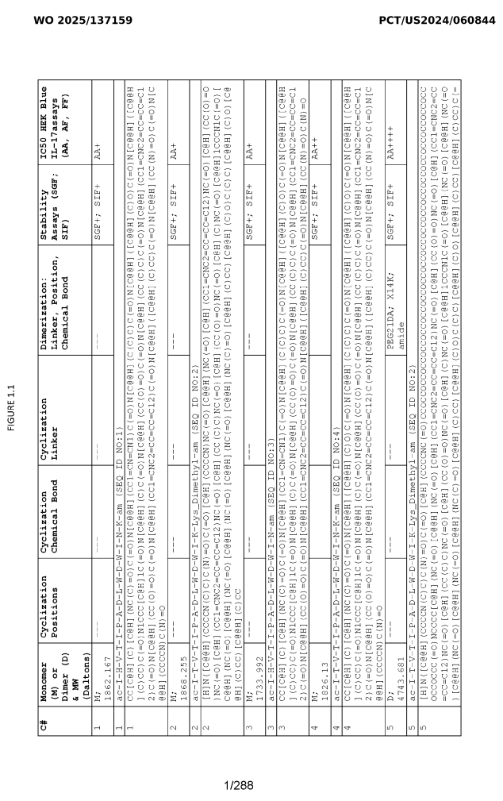
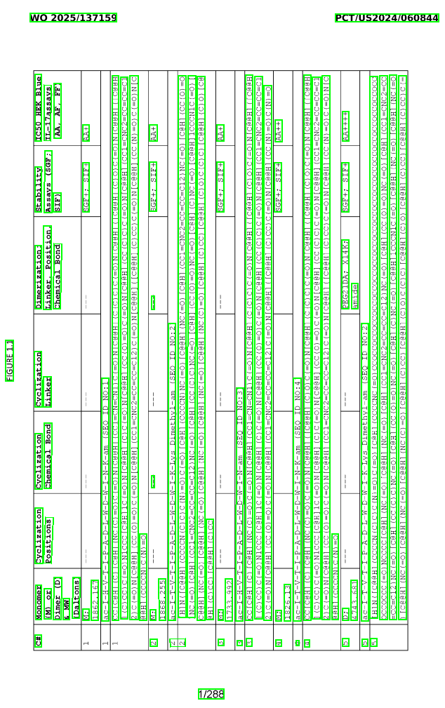
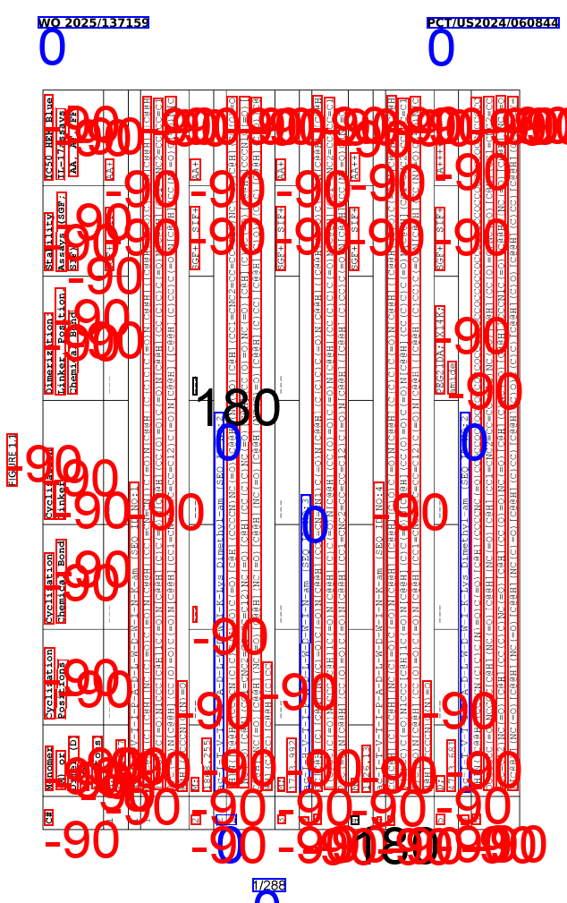
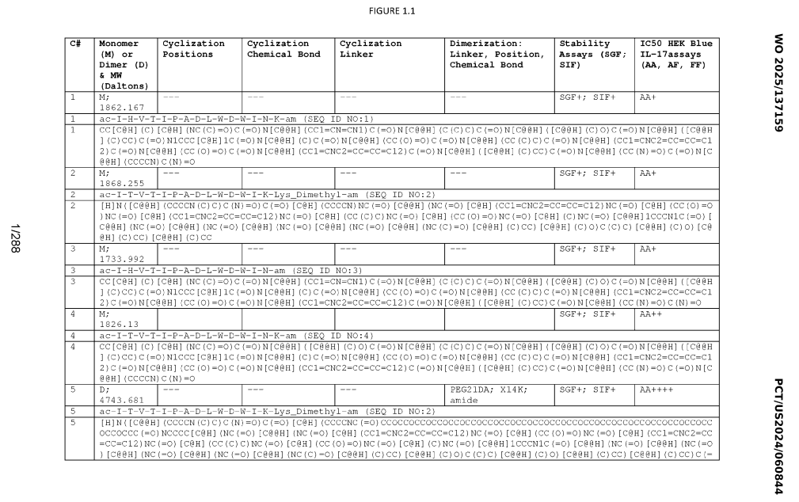
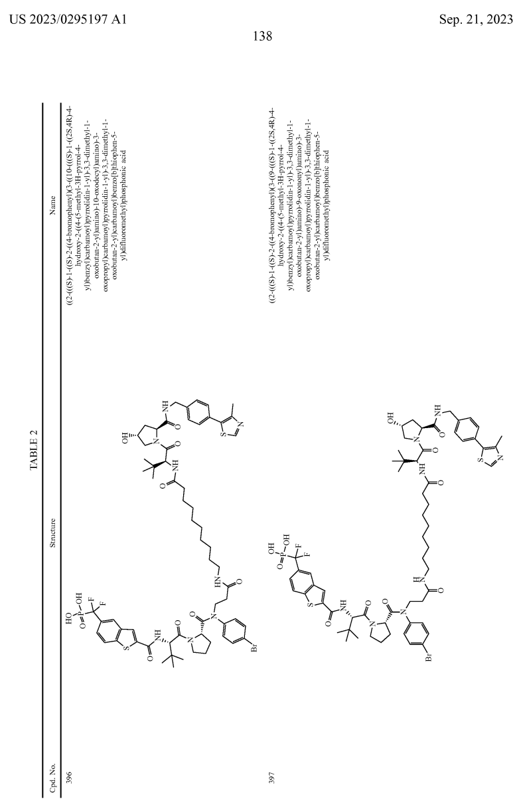
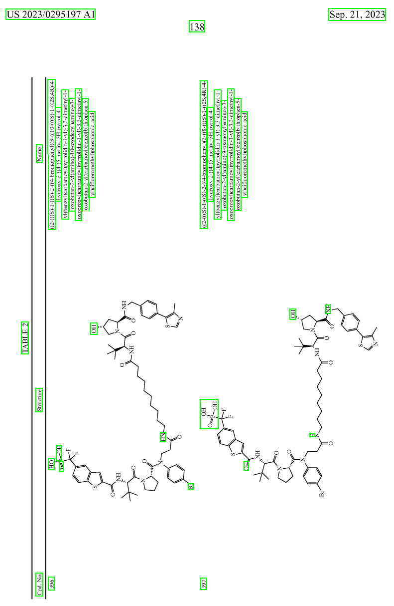
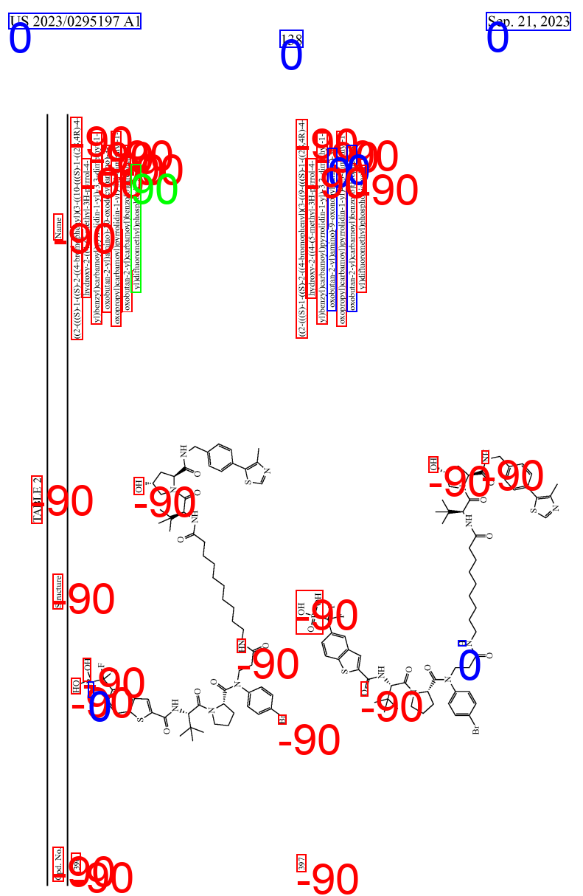
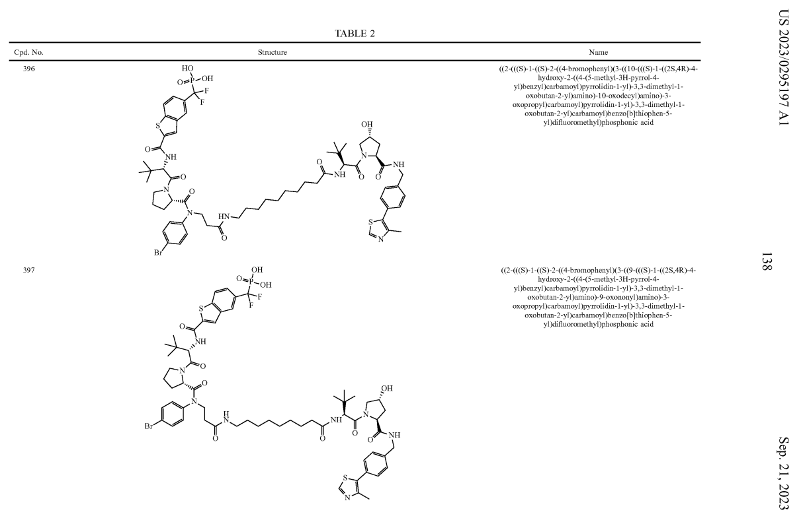

<!-- START doctoc generated TOC please keep comment here to allow auto update -->
<!-- DON'T EDIT THIS SECTION, INSTEAD RE-RUN doctoc TO UPDATE -->
**Table of Contents**  *generated with [DocToc](https://github.com/thlorenz/doctoc)*

- [1. 介绍](#1-%E4%BB%8B%E7%BB%8D)
- [2. 为什么选择本工具？​​](#2-%E4%B8%BA%E4%BB%80%E4%B9%88%E9%80%89%E6%8B%A9%E6%9C%AC%E5%B7%A5%E5%85%B7%E2%80%8B%E2%80%8B)
- [3. 方法(流程)](#3-%E6%96%B9%E6%B3%95%E6%B5%81%E7%A8%8B)
- [3. 安装](#3-%E5%AE%89%E8%A3%85)
- [4. 运行](#4-%E8%BF%90%E8%A1%8C)
- [5. 结果&效果展示](#5-%E7%BB%93%E6%9E%9C%E6%95%88%E6%9E%9C%E5%B1%95%E7%A4%BA)

<!-- END doctoc generated TOC please keep comment here to allow auto update -->


## 1. 介绍
本仓库提供了一套高效的文档图像预处理工具，专注于解决 ​​文档页面角度矫正问题​​，尤其针对以下两种常见场景：
​
* `0°`文档​​：标准水平放置的文档（无需矫正）。
* ​`-90°`文档​​：垂直旋转90度（逆时针旋转）的文档（重点优化场景）。
通过智能检测和几何变换，自动将倾斜或旋转的文档校正为标准阅读方向，显著提升后续OCR或内容分析的准确性。

> 当前版本​​无法较好地区分`0°`和`180°`​​、​`​-90°`和`90°​​`

## 2. 为什么选择本工具？​​
✅ ​​高频场景覆盖​​：
解决80%以上的文档旋转问题（0°/-90°为主，90°/180°较少见）。
对OCR、文档分类等下游任务足够鲁棒。


✅ ​​极速响应​​：
基于传统图像处理算法（无深度学习依赖），单张图像处理时间<1s。
支持批量处理，适合扫描仪流水线集成。


✅ ​​零配置开箱即用​​：
无需训练数据或参数调优，自动适配多数文档类型。

## 3. 方法(流程)
以`bottom-up`（自底向上）方法识别页面布局
* 首先使用`surya-detection`检测出所有文本的`polygo`或者`bbox`

* 随后使用doctr中的朝向识别模型对所有的`polygo`和`bbox`所在的图片进行朝向识别（Document Orientation Detection），最后选择所有朝向的`众数`作为最后的识别结果


## 3. 安装
需要`python>=3.10`, `python-doctr==1.0.0`以及`surya-ocr==0.14.0`
```cmd
pip install -r requirement.text
```

## 4. 运行
```cmd
python Document_Orientation_Detection.py
```

## 5. 结果&效果展示
在**仅考虑**​​`0°`和​​`-90°`的场景下，在几篇文档中（约500张）朝向识别准确率接近100%.

### 效果展示
<table style="
    width: 100%;
    border-collapse: collapse;
    margin: 20px 0;
    box-shadow: 0 2px 4px rgba(0, 0, 0, 0.1);
    text-align: center;
">
    <thead>
        <tr style="background-color: #f8f9fa;">
            <th style="
                padding: 12px;
                border-bottom: 1px solid #ddd;
            ">类别</th>
            <th style="
                padding: 12px;
                border-bottom: 1px solid #ddd;
            ">原图</th>
            <th style="
                padding: 12px;
                border-bottom: 1px solid #ddd;
            ">检测</th>
            <th style="
                padding: 12px;
                border-bottom: 1px solid #ddd;
            ">注释</th>
            <th style="
                padding: 12px;
                border-bottom: 1px solid #ddd;
            ">矫正后的图片</th>
            <th style="
                padding: 12px;
                border-bottom: 1px solid #ddd;
            ">矫正角度(bottom-up)√</th>
            <th style="
                padding: 12px;
                border-bottom: 1px solid #ddd;
            ">矫正角度(top-down)×</th>
        </tr>
    </thead>
    <tbody>
        <tr>
            <td style="
                padding: 12px;
                border-bottom: 1px solid #ddd;
                font-weight: bold;
            ">表格</td>
            <td style="
                padding: 12px;
                border-bottom: 1px solid #ddd;
            ">
                
            </td>
            <td style="
                padding: 12px;
                border-bottom: 1px solid #ddd;
            ">
                
            </td>
            <td style="
                padding: 12px;
                border-bottom: 1px solid #ddd;
            ">
                
            </td>
            <td style="
                padding: 12px;
                border-bottom: 1px solid #ddd;
                font-weight: bold;
            ">
                
            </td>
            <td style="
                padding: 12px;
                border-bottom: 1px solid #ddd;">-90°</td>
            <td style="
                padding: 12px;
                border-bottom: 1px solid #ddd;">0°</td>
        </tr>
        <tr>
            <td style="
                padding: 12px;
                border-bottom: 1px solid #ddd;
                font-weight: bold;
            ">分子</td>
            <td style="
                padding: 12px;
                border-bottom: 1px solid #ddd;
            ">
                
            </td>
            <td style="
                padding: 12px;
                border-bottom: 1px solid #ddd;
            ">
                
            </td>
            <td style="
                padding: 12px;
                border-bottom: 1px solid #ddd;
            ">
                
            </td>
            <td style="
                padding: 12px;
                border-bottom: 1px solid #ddd;
            ">
                
            </td>
            <td style="
                padding: 12px;
                border-bottom: 1px solid #ddd;">-90°</td>
            <td style="
                padding: 12px;
                border-bottom: 1px solid #ddd;">0°</td>
        </tr>
        <tr>
            <td style="
                padding: 12px;
                border-bottom: 1px solid #ddd;
                font-weight: bold;
            ">分子+表格</td>
            <td style="
                padding: 12px;
                border-bottom: 1px solid #ddd;
            ">
                
            </td>
            <td style="
                padding: 12px;
                border-bottom: 1px solid #ddd;
            ">
                
            </td>
            <td style="
                padding: 12px;
                border-bottom: 1px solid #ddd;
            ">
                
            </td>
            <td style="
                padding: 12px;
                border-bottom: 1px solid #ddd;
            ">
                
            </td>
            <td style="
                padding: 12px;
                border-bottom: 1px solid #ddd;">-90°</td>
            <td style="
                padding: 12px;
                border-bottom: 1px solid #ddd;">-90°</td>
        </tr>
    </tbody>
</table>
